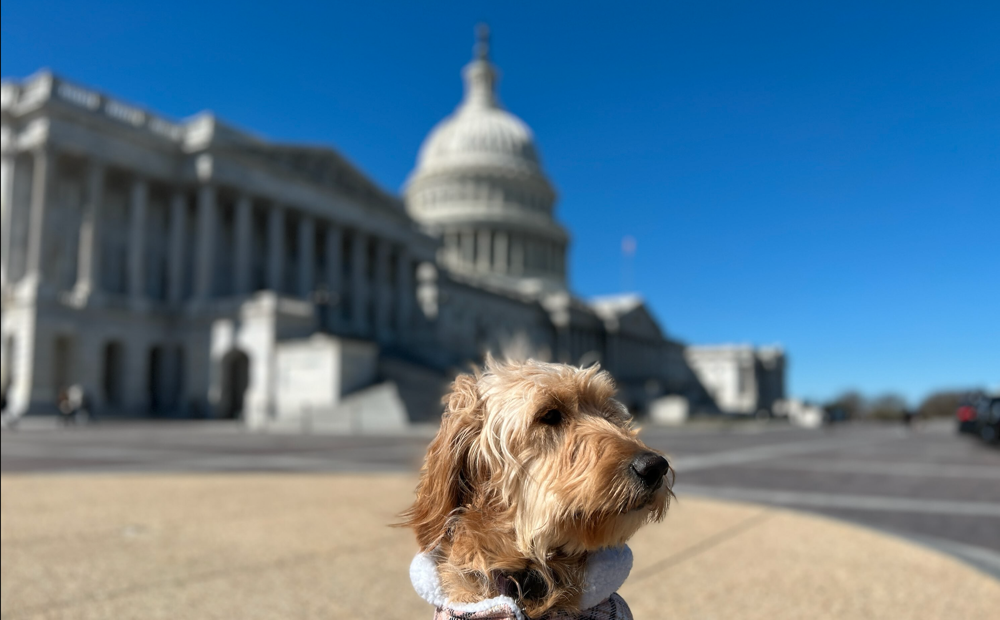

# :us: Good Bill Hunting

### By: Josh Holt, Adam Heywood, Bart Taylor and Jorge Lopez

## :scroll: Goal: 
We aquired legislative bills between 2001 and 2023. Our goal is to identify bills that hit the political sweet spot. It aligns with the sponsor's political party and will recieve bipartisan support.

## :book: Data Dictionary:
| Feature | Definition |
|:--------|:-----------|
|congressional bill| legislative proposals from the House of Representatives and Senate within the United States Congress. More info: https://www.govinfo.gov/help/bills#:~:text=A%20bill%20is%20a%20legislative,(first%20and%20second%20sessions). |
|political party| Made up of individuals who organize to win elections, operate government, and influence public policy. The Democratic and Republican parties are currently the primary parties in Congress. More info: https://www.senate.gov/reference/reference_index_subjects/Political_Parties_vrd.htm|
|sponsor| Patron, usually a legislator, who presents a bill or resolution to a legislature for consideration.|
|initial cosponsor or original cosponsor| Senator or representative who was listed as a cosponsor at the time of a bill's introduction.|
|partisan| From a single political party.|
|bipartisan| From two different political parties.|

## :balance_scale: How laws are made: 

https://www.house.gov/the-house-explained/the-legislative-process

Basic Steps of the legislative process:
1. First, a Representative sponsors a bill. 
2. The bill is then assigned to a committee for study. 
3. If released by the committee, the bill is put on a calendar to be voted on, debated or amended. 
4. If the bill passes by simple majority (218 of 435), the bill moves to the Senate. 
5. In the Senate, the bill is assigned to another committee and, if released, debated and voted on. 
6. If the Senate makes changes, the bill must return to the House for concurrence.  
7. The resulting bill returns to the House and Senate for final approval. 
8. The President then has 10 days to veto the final bill or sign it into law.

## :page_with_curl: Data Overview:
#### We acquired 26,000+ bills from api.govinfo.gov/.

- Target Variable #1: Sponsor's political party. Example: Democrat, Republican, or Independent
- Target Variable #2: Cosponsor's political party is different than the sponsor's. 

- One Observation Represents: A sponsored bill
- Initial steps: API scraping, acquiring data and preparing the bills for exploration.

## :question: Initial Questions:
1) Are there any words unique to a specific political party in determine Congressional Bills?
2) What are the top focus areas for each political party and are there any bi-partisan areas or Congressional Bills?

## :busts_in_silhouette: To reproduce:
1. Get an api key from: https://www.govinfo.gov/api-signup
2. Append "&api_key=" to the beginning of your api key string.
3. In your env.py file, save your api key under the variable "api_key"
4. Clone the political_parser repo
5. Install the required python packages.
6. Allow several hours to acquire the data. We created another notebook, "acquire_in_chunks", to spread out the download and prevent losing the data late in the process. Ours took 10+ hours or 5ish hours running two notebooks in parallel on different chunks.
7. Once the data is acquired, run the final notebook. It takes about 20-30 minutes.

## Project Plan:
1. Acquire data from govinfo.gov's api.
2. Prepare data by dropping nulls (one row), cleaning and lemmatizing the text.
3. Explore the words each party uses.
4. Modeling using XGBoost, Decision Tree, Random Forest and Logistic Regression.
    - Accuracy will be the baseline we use for this project.

## Explore Takeaways:
- Each political party had a focus area of concentration: 
    - Democrat's main areas appear to be healthcare and higher education. 
    - Republicans are focused on homeland security and China.
    - Independents tend to lean toward economic concerns.
    - Bipartisan support is split into thirds:
        - 1/3 No cosponsor
        - 1/3 Same party cosponsor
        - 1/3 Different party cosponsor
- The large amount of bills by democrats (60%) versus the other political parties (40%) may be obscuring the data from the other parties.
- Common areas of concern appear to be health care and term limits, at least for democrats and republicans.
- Although specific words may not necessarily determine if a bill is a certain political party, there are some words that are associated with particular political interests that could determine if a bill is from a particular political party.

## First Model Takeaways:
- Our baseline was predicting Democrat at 59%
- Four of the five models performed better than the baseline on train and validate.
- The Logistic Regression model performed the best on train (75%) and validate (71%).
- We chose to move forward with the Logistic Regression model.

## Second Model Takeaways:
- Our baseline was predicting Non-partisan support at 67%
- All four models performed better than baseline on train and validate.
- The Logistic Regression model performed the best on train (76%) and validate (72%).
- We chose to move forward with the Logistic Regression model. 

## Deliverables:
- A model that predicts the politcial party of the sponsor.
- A model that predicts if the bill will recieve support from a party different than their own.

## :footprints: Next Steps:
- Adding time series analysis:
    - Exploring election years.
    - How focus areas change over time.
    - Response to major events.
- Build a model that would predict, based off of the language, whether a bill is made into law or not.
- Link bills to funding, cost of development, total cost to taxpayers and other monitary metrics.

#### Photo credit:
https://www.instagram.com/adventuresofharleyandme/
